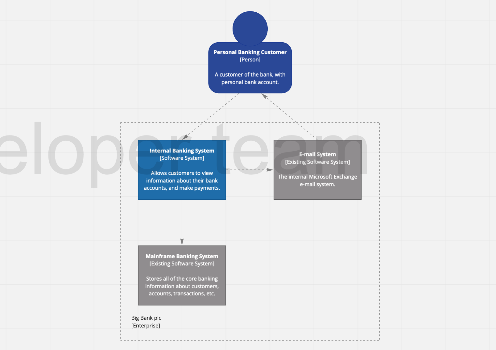
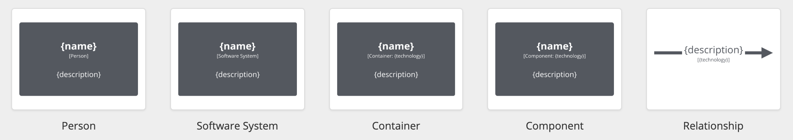

# C4-Miro

The [C4 model](https://c4model.com/#coreDiagrams) was created as a way to help software development teams describe and communicate software architecture with an intuitive language. Plugin C4-Miro is modelling and drawing tool which can help create C4 model diagrams based Miro.


## Get started
Install dependencies: `yarn`

Serve app `yarn serve`

## Syntax
The C4 model doesn't prescribe any particular notation. A simple notation that works well on whiteboards, paper, sticky notes, index cards and a variety of diagraming tools is as follows.


Supported objects:

Person

```
person = Person("Name", "Description");
```

Software System

```
soft1 = System("Name", "Description");
soft2 = ExistingSystem("Name", "Description");
```

Container

```
container = Container("Name", "Description", "Technology");
```

Component

```
component = Component("Name", "Description", "Technology");
```

Database

```
db = Database("Name", "Description", "Technology");
```

Relationship

```
Rel(obj1, obj2, "Description", "Technology");
```

Boundary

```
Boundary("Name", "Type") {
soft1 = System("Name", "Description");
soft2 = ExistingSystem("Name", "Description");
}
```